# API Hub Anexar

Multi-company integration platform designed to centralize external integrations, manage company-specific access, monitor executions, and provide logs and auditing for integration processes.

This project was developed with a focus on real-world business needs, including authentication, access control, company management, integration management, runtime monitoring, ERP connection configuration, and cloud deployment.

> This repository is a public showcase of the project. Sensitive information such as credentials, tokens, host addresses, company documents, user logins, and private business data were hidden or replaced for public presentation.

---

## Overview

API Hub Anexar is a web platform created to work as a centralized integration layer between companies and external systems.

Instead of each company managing isolated integrations manually, the platform provides a single environment where administrators can register companies, configure ERP integrations, manage users, monitor execution logs, and control access through authentication and authorization rules.

The system follows a multi-company structure, where each company can have its own data, users, integrations, access permissions, tokens, and ERP connection settings.

Main goals of the project:

- Centralize external integrations
- Manage companies and users
- Control access by user profile
- Register and monitor integration processes
- Manage company-specific tokens
- Configure ERP database connections
- Provide execution logs and audit history
- Improve visibility over integration status
- Support deployment in a cloud environment

---

## Features

### Authentication and Access Control

- Login screen with restricted access
- JWT-based authentication
- Password encryption
- Protected routes
- Role-based access control
- Separate access flows for administrators and company users

### Administrative Dashboard

- General system overview
- Company count
- User count
- Integration count
- Quick actions
- System version information
- Operational status monitoring

### Company Management

- Company listing
- Company search by name or document
- Company registration
- Support for CNPJ and CPF registration flows
- ERP selection per company
- Active/inactive company status control
- Company-specific integration configuration

### User Management

- User listing
- User creation
- User editing
- Password management
- User status control
- User profile definition
- Company association
- Global and company-specific users

### Integration Management

- Native integration listing
- ERP-based integration grouping
- Endpoint visualization
- Request headers examples
- Request body examples
- Expected response documentation
- Copy endpoint, headers, and body actions
- Company-specific token usage

### Company Token Management

- Unique token per company
- Token usage in external API calls
- Token copy action
- Token renewal/revocation flow
- External request identification using custom headers

### ERP Connection Configuration

- ERP database connection setup
- Host configuration
- Port configuration
- User configuration
- Password configuration
- Charset configuration
- Dialect configuration
- Database path configuration
- Protected fields for connection data

### Logs and Auditing

- Execution history by company
- Event type filtering
- Status filtering
- Date range filtering
- Text search
- HTTP status tracking
- Execution time tracking
- Details view for each log entry
- Operational visibility for administrators

### Cloud Deployment

- Backend deployment in a cloud environment
- Process management with PM2
- PostgreSQL database structure
- Environment-based configuration
- Production-oriented architecture

---

## Technologies

### Frontend

- React
- Vite
- JavaScript
- React Router
- CSS

### Backend

- Node.js
- Express
- JavaScript ES Modules
- JWT Authentication
- bcryptjs
- CORS
- REST APIs

### Database

- PostgreSQL
- SQL scripts
- Relational data modeling

### Deployment and Infrastructure

- Docker
- PM2
- Cloud server deployment
- Environment variables
- Production build with Vite

### Tools

- Git
- GitHub
- Postman / API testing
- Linux server environment

---

## Architecture

The project follows a separated frontend, backend, and database architecture.

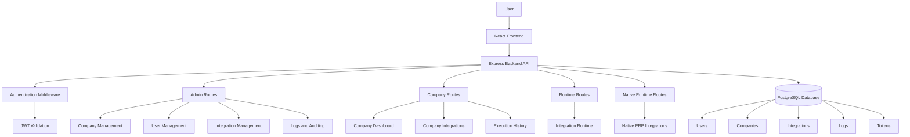

### General Structure

```txt
api-hub-anexar/
│
├── frontend/
│   ├── src/
│   │   ├── pages/
│   │   ├── components/
│   │   ├── routes/
│   │   ├── services/
│   │   └── styles/
│   │
│   └── package.json
│
├── backend/
│   ├── src/
│   │   ├── routes/
│   │   ├── middlewares/
│   │   ├── controllers/
│   │   ├── database/
│   │   └── server.js
│   │
│   └── package.json
│
├── database/
│   └── init.sql
│
├── assets/
│   └── screenshots/
│
└── README.md
```

### User Profiles

| Profile | Description |
|---|---|
| Global Administrator | Manages companies, users, integrations, logs, tokens, and system settings |
| Company Administrator | Manages company-specific users, integrations, and operational information |
| Operational User | Accesses operational features related to integrations and execution history |

---

## Screenshots

> Sensitive information such as tokens, credentials, host addresses, company documents, user logins, and private data were hidden or replaced for public presentation.

### Login

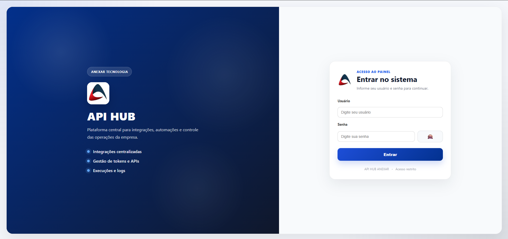

### Administrative Dashboard

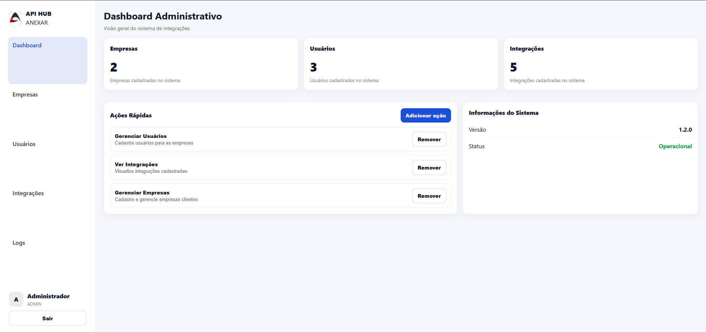

### Company Management

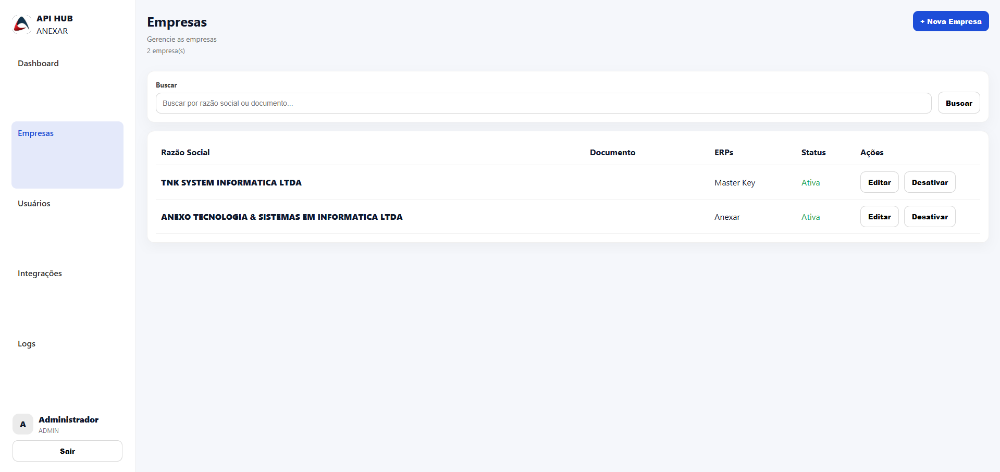

### Company Registration - CNPJ

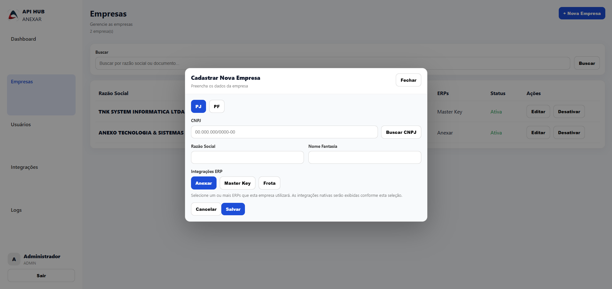

### Company Registration - CPF

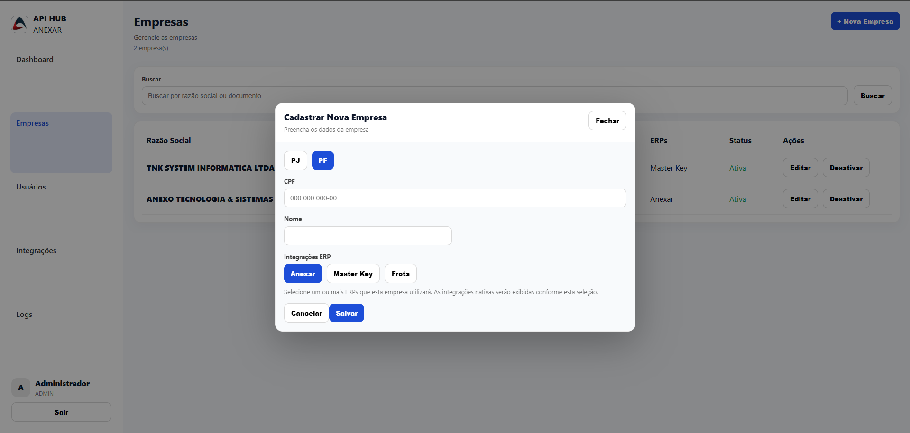

### User Management

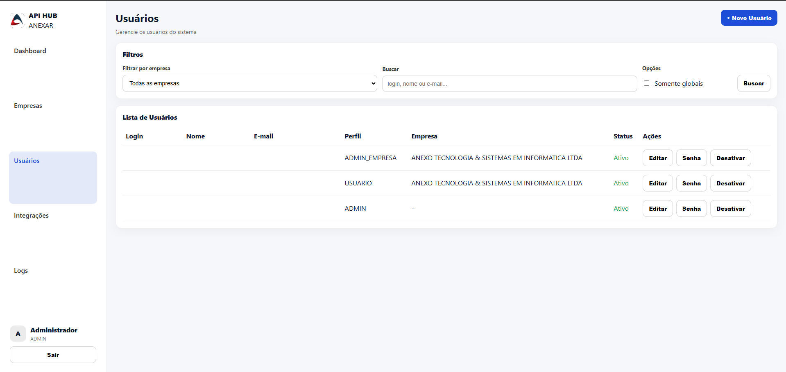

### User Registration

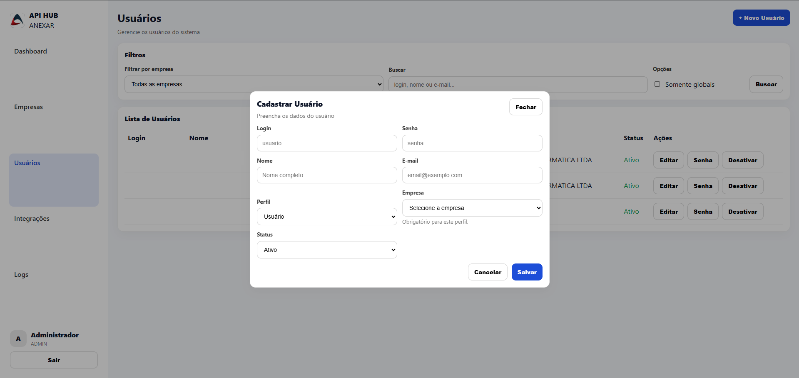

### Integration Management

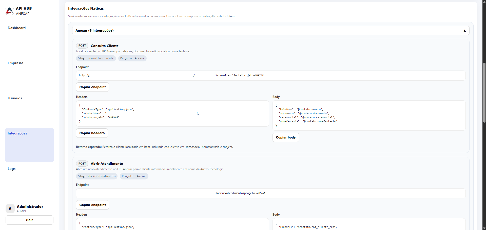

### ERP Connection Configuration

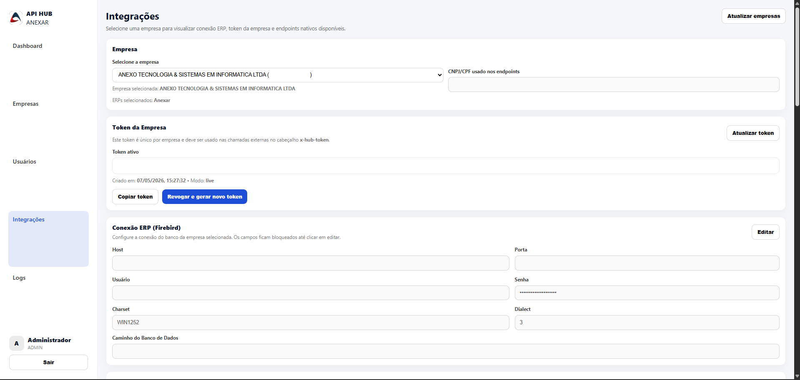

### Logs and Execution History

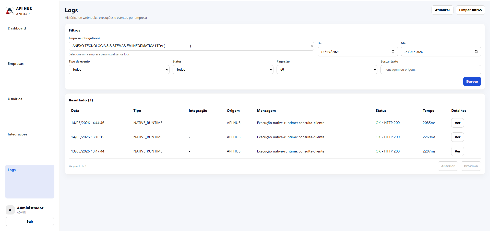

---

## Status

**Current status:** In development / initial production phase.

The project already includes the main base structure for authentication, protected routes, administrative screens, company management, user management, integration management, token management, ERP connection configuration, logs, backend API, PostgreSQL database structure, and cloud deployment.

### Implemented

- React frontend structure
- Node.js and Express backend API
- JWT authentication
- Protected routes
- Role-based access control
- Admin dashboard
- Company management
- User management
- Company token management
- Native integration listing
- ERP connection configuration
- Logs and execution history
- PostgreSQL database structure
- Cloud deployment setup
- Backend process management with PM2

### In progress

- Improvements in integration execution flow
- More detailed dashboards
- Advanced filtering for logs
- Better error handling
- UI refinements
- Documentation expansion
- Public showcase repository organization

### Planned improvements

- More advanced audit reports
- Integration health indicators
- Automated deployment pipeline
- Notification system
- More detailed company-level permissions
- API documentation
- Unit and integration tests
- Improved dashboard metrics

---

## What I learned

During the development of this project, I improved my understanding of full-stack application development and real-world system architecture.

Main learning points:

- Structuring a full-stack project with React, Node.js, Express, and PostgreSQL
- Implementing JWT authentication and protected routes
- Organizing role-based access control
- Designing a multi-company system structure
- Managing company-specific tokens
- Creating administrative dashboards
- Building user and company management flows
- Structuring native integration endpoints
- Working with PostgreSQL and relational data modeling
- Preparing a backend for cloud deployment
- Managing backend processes with PM2
- Handling environment variables for development and production
- Debugging API routes, CORS issues, build issues, and deployment errors
- Thinking about scalability, auditing, logs, and operational monitoring

This project helped me move beyond basic CRUD applications and understand how business-oriented systems are structured, deployed, monitored, and maintained.

---

## Repository Purpose

This repository is intended to present the project as part of my development portfolio.

The main purpose is to demonstrate:

- System architecture
- Business-oriented development
- Full-stack implementation
- Authentication and access control
- Multi-company structure
- Integration management
- Logs and auditing
- Cloud deployment experience

Some implementation details, credentials, internal endpoints, and business-sensitive information are not publicly exposed.

---

## Contact

**Developer:** Felipe Macedo  
**GitHub:** [github.com/fjahnm](https://github.com/fjahnm)  
**LinkedIn:** [Felipe Macedo](https://www.linkedin.com/in/felipe-macedo-54273b26a/)  
**Email:** felipejmacedo3@gmail.com
